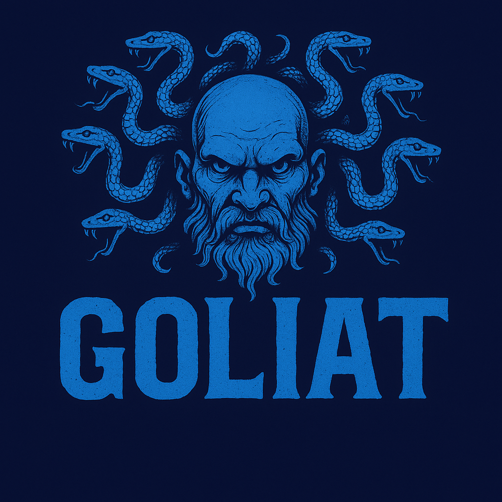

<p align="center">
  
</p>

<h1 align="center">🔐 GOLIAT – Sistema Avanzado de Contraseñas con IA</h1>

<p align="center">
  <b>Gestión. Seguridad. Inteligencia. Todo en uno.</b><br>
  Análisis, generación y protección de contraseñas como nunca antes.
</p>

<p align="center">
  <a href="https://github.com/nytrek/goliat">
    
  </a>
  <a href="https://github.com/nytrek/goliat">
    
  </a>
  
  
</p>

---

## 🚀 ¿Qué es GOLIAT?

GOLIAT es un sistema ultra-avanzado para analizar y generar contraseñas seguras usando técnicas de inteligencia artificial heurística. Pensado para ciberseguridad real, ofrece evaluaciones inteligentes, análisis de brechas, generación de contraseñas personalizadas y una interfaz de consola visual y profesional.

---

## 🧠 Características

- 🔍 Análisis IA de contraseñas (entropía, patrones, teclado, fechas, leet speak, etc.)
- 🚨 Verificación de brechas con la API de [Have I Been Pwned](https://haveibeenpwned.com/)
- 🔐 Generación avanzada: criptográfica, pronunciable, frase, patrón
- 📊 Visualización avanzada con [Rich](https://github.com/Textualize/rich)
- 📈 Estadísticas, puntuación, tiempo de crackeo, recomendaciones
- 💾 Exportación a JSON, CSV, TXT
- 🔒 Historial y base de datos local en SQLite

---

## 🖼️ Capturas de pantalla

### 🏠 Menú principal


### 📊 Análisis de contraseña


---

## 📦 Instalación

### Requisitos
- Python 3.9 o superior
- `pip`

### Instalar y ejecutar

```bash
git clone https://github.com/nytrek/goliat.git
cd goliat
pip install -r requirements.txt
python goliat.py
